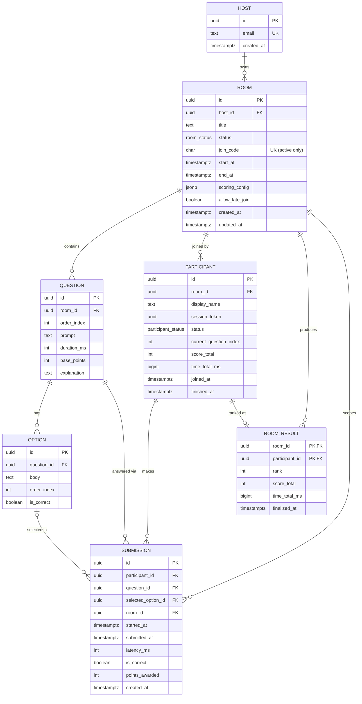

# Relational Model — Quiz / Contest Platform

Companion to the system design. This is the normalized (BCNF) logical model. Where the implementation DDL denormalizes for performance, that's called out in §6.

**Notation:** `**bold**` = primary-key attribute · _italic_ = foreign key · `UK` = unique (candidate) key.

---

## 1. ER diagram



---

## 2. Relation schemas

**host**(**id**, email, created_at)
- `UK`: email · (may instead be Supabase `auth.users`)

**room**(**id**, _host_id_, title, status, join_code, start_at, end_at, scoring_config, allow_late_join, created_at, updated_at)
- FK: host_id → host(id)
- `UK`: join_code — *partial*, unique only across active statuses (`ready`, `scheduled`, `live`); recycled afterward

**question**(**id**, _room_id_, order_index, prompt, duration_ms, base_points, explanation)
- FK: room_id → room(id)
- `UK`: (room_id, order_index)

**option**(**id**, _question_id_, body, order_index, is_correct)
- FK: question_id → question(id)
- `UK`: (question_id, order_index)

**participant**(**id**, _room_id_, display_name, session_token, status, current_question_index, score_total, time_total_ms, joined_at, finished_at)
- FK: room_id → room(id)
- `UK`: (room_id, session_token)

**submission**(**id**, _participant_id_, _question_id_, _selected_option_id_, _room_id_, started_at, submitted_at, latency_ms, is_correct, points_awarded, created_at)
- FK: participant_id → participant(id) · question_id → question(id) · selected_option_id → option(id) *(nullable = no answer)* · room_id → room(id)
- `UK`: (participant_id, question_id) — enforces exactly-once

**room_result**(**room_id**, **participant_id**, rank, score_total, time_total_ms, finalized_at)
- FK: room_id → room(id) · participant_id → participant(id)
- `UK`: (room_id, rank)

---

## 3. Relationships & cardinalities

| Parent | Child | Cardinality | Meaning |
|---|---|---|---|
| host | room | 1 : 0..N | a host owns many rooms; each room one host |
| room | question | 1 : 0..N | a room has many questions |
| question | option | 1 : 2..N | each question has its answer choices (≥2) |
| room | participant | 1 : 0..N | a room is joined by many participants |
| participant | submission | 1 : 0..N | a participant makes many submissions |
| question | submission | 1 : 0..N | a question is answered by many participants |
| option | submission | 0..1 : 0..N | a submission selects ≤1 option; an option is chosen by many |
| participant | room_result | 1 : 0..1 | each participant gets one final standing once finalized |

**`submission` is an associative entity** resolving the M:N between **participant** and **question** (a participant answers many questions; a question is answered by many participants), enriched with timing and scoring attributes. `(participant_id, question_id)` is its natural composite key — the surrogate `id` is for convenience; the unique constraint enforces the real identity.

---

## 4. Key functional dependencies

```
room:          id → host_id, title, status, join_code, start_at, end_at, ...
               join_code → id          (within active rows only)
question:      id → room_id, order_index, prompt, duration_ms, base_points
               (room_id, order_index) → id
option:        id → question_id, body, order_index, is_correct
               (question_id, order_index) → id
participant:   id → room_id, display_name, session_token, status, score_total, ...
               (room_id, session_token) → id
submission:    id → everything
               (participant_id, question_id) → id, selected_option_id, latency_ms, ...
room_result:   (room_id, participant_id) → rank, score_total, time_total_ms
               (room_id, rank) → participant_id
```

Every determinant above is a candidate key, so the schema is in **BCNF** (hence also 3NF / 2NF / 1NF — all attributes are atomic now that options are normalized out of the array).

---

## 5. Referential integrity (on-delete)

- `room` deleted → **CASCADE** to question, option, participant, submission, room_result (a deleted room takes its whole graph).
- `question` / `participant` deleted → **CASCADE** to submission.
- `option`: do **not** delete options for a room that has been played — use **RESTRICT** (or `SET NULL` on `submission.selected_option_id`) so historical submissions never dangle.
- `submission.selected_option_id` is **nullable** (NULL = unanswered / expired).

---

## 6. Deliberate denormalizations (and why)

These are intentional, justified redundancies — not modeling mistakes:

1. **`submission.is_correct` and `points_awarded`** are derivable from `selected_option_id → option.is_correct` plus timing, but they're **frozen at submission time**. This makes the score an immutable historical fact even if a host later edits a question/option, and avoids a join on every leaderboard read.
2. **`participant.score_total` / `time_total_ms`** are aggregates of that participant's submissions, kept materialized for the hot leaderboard path (the Redis ZSET mirrors these). Source of truth remains `submission`; these are rebuildable by re-aggregation.
3. **`room_result`** is a materialized final snapshot of the leaderboard so standings stay queryable forever after Redis evicts and even if underlying rows change.
4. **`submission.room_id`** duplicates `participant.room_id` purely so room-scoped queries (and partitioning) avoid an extra join.


-- Yash 
