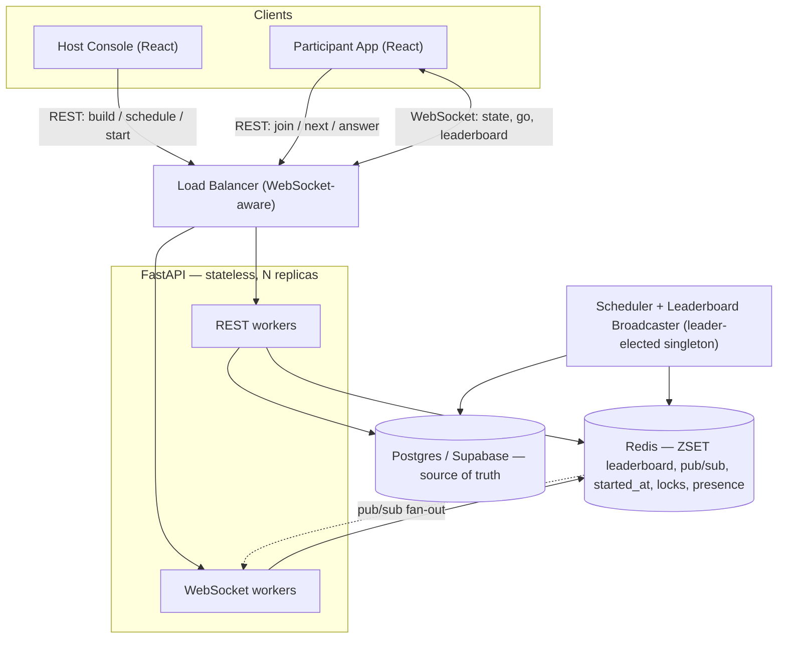
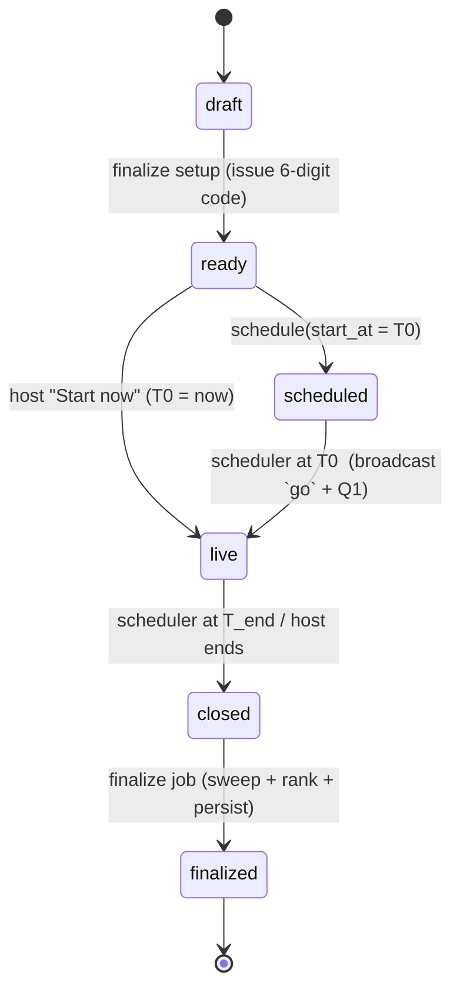

# Real-Time Quiz / Contest Platform — System Design

A reliable, horizontally-scalable platform for timed multiple-choice contests with a live, speed-weighted leaderboard.

---

## 1. Locked requirements

| Decision | Choice |
|---|---|
| Progression | **Self-paced** — each participant flows through questions independently |
| Timers | **Per-question only**; total budget = Σ(question durations) |
| Scheduled start | **Shared** — lobby opens, everyone released at `T0`, hard close at `T_end` |
| Scoring | **Speed-weighted** — faster correct answer = more points |
| Scale target | **Large** — thousands per room and/or many concurrent rooms |
| Real-time transport | **Self-hosted WebSockets + Redis pub/sub** |

**Baked-in defaults (configurable / redline-able):**
- Submitted answers are **final**, no going back, linear order.
- Timing deadlines are **absolute server-side timestamps** → refresh/disconnect resumes exactly; the clock does **not** pause while a tab is closed (contest integrity).
- Joiners are **anonymous** (display name + 6-digit code, no signup), identified by a session token.
- **Late join OFF** for scheduled rooms (lobby closes at `T0`).
- **Correct answers hidden** until `T_end` / finalization (no leakage during the live window).
- **Expired questions auto-record as 0** (latency = full duration).

**Derived timing:** `T_end = T0 + Σ(duration_i) + grace`. Since everyone starts at `T0` and each question is capped, no one can naturally finish later than this.

---

## 2. Architecture



**Component responsibilities**

- **React SPA** — host builder/monitor + participant play UI. One WebSocket per client for the live downstream; REST for everything that mutates or scores.
- **FastAPI (stateless)** — the only authority. Generates codes, issues questions with a server `started_at`, validates + scores submissions, drives state transitions, writes Postgres + Redis, publishes to Redis pub/sub. Run HTTP and WS as the same app or split process pools; both are stateless so you scale by adding replicas.
- **Redis** — (a) live leaderboard ZSET per room, (b) per-`(participant, question)` `started_at`, (c) **pub/sub backplane** so any worker can push to any room's sockets, (d) idempotency locks + rate limiting, (e) presence (`online` set with heartbeat TTL).
- **Postgres (Supabase)** — durable record: rooms, questions, participants, submissions, final results. Supabase Auth (or your own JWT) for hosts; RLS isolates host data. **Participants never read questions directly from Supabase** — that would leak correct answers. All play traffic goes through FastAPI.
- **Scheduler / Broadcaster** — one logical singleton (leader-elected via a Redis lock; transitions are idempotent so a double-fire is harmless). Flips `scheduled→live` at `T0`, `live→closed` at `T_end`, runs finalize, and ticks the per-room leaderboard snapshot.

**Why this scales horizontally:** the only shared hot state lives in Redis + Postgres. FastAPI workers hold nothing durable, so a crash just means clients reconnect elsewhere and retry idempotent calls. WebSocket fan-out goes through Redis pub/sub, so a submission processed on worker B can still reach a socket held by worker A — **no sticky sessions required**.

---

## 3. The real-time layer (the heart of it)

### 3.1 The fan-out problem
If every one of *N* submissions pushes an update to all *N* clients, traffic grows ~*N²* and a large room collapses. The fix is to **decouple writes from broadcasts**:

1. **On every answer** → `ZADD room:{id}:lb <composite> <participant_id>` — O(log N), happens at full submission rate, cheap.
2. **A snapshot broadcaster** (one per active room) runs every **1–2s**: reads the top-K (`ZREVRANGE room:{id}:lb 0 K-1 WITHSCORES`) and publishes **one** message to channel `room:{id}:lb`. Broadcast volume = `rooms × (1/interval)` — **independent of how many people are submitting**.
3. **Any participant's exact rank** is `ZREVRANK room:{id}:lb <participant_id>` — O(log N), computed on the snapshot tick or on demand, so users outside the top-K still see "you're #347 of 5,000" without the whole board being streamed.

Snapshots are idempotent state, not a delta stream — if a socket's send buffer is full you can **drop stale snapshots** and only send the latest. The interval can adapt (1s under ~1k, 2–3s for larger rooms).

### 3.2 Tie-break inside a single ZSET score
A ZSET sorts by one float. We want **points desc, then total time asc** (less time wins ties). Encode both into one composite so even `ZREVRANK` for arbitrary users respects the tie-break:

```python
# points_total: integer, bounded (e.g. <= 100 questions * 1000 = 100_000)
# time_total_ms: lower is better on ties
def composite(points_total: int, time_total_ms: int) -> float:
    # fractional term < 1 always (time under ~11.5 days), so points always dominate;
    # more time -> smaller composite -> lower rank. Well within float64 precision.
    return points_total - (time_total_ms / 1e9)
```

### 3.3 Channels & WS lifecycle
- `room:{id}:state` — lifecycle changes, lobby countdown, the **`go` signal at T0**, `finalized`.
- `room:{id}:lb` — top-K leaderboard snapshots.
- Per-participant rank rides on that participant's own socket (computed at snapshot tick).

**Connect** → authenticate (participant session token or host JWT via a short-lived WS ticket), subscribe the worker to the room's channels, register the socket locally, `SADD room:{id}:online <pid>` with a heartbeat TTL.
**Heartbeat** ping/pong to reap dead sockets.
**Reconnect** → re-auth, server resends current room state + the participant's current question with `remaining = deadline − now` + the latest snapshot. Because deadlines are absolute, resume is exact.

---

## 4. Question delivery + timer + scoring (per-user core)

```mermaid
sequenceDiagram
  participant C as Client
  participant A as FastAPI
  participant R as Redis
  participant D as Postgres

  C->>A: POST /next
  A->>A: assert room live AND now < T_end AND not finished
  A->>R: HSETNX starts (pid:qid) = now   %% idempotent: same start on retry
  A-->>C: question (NO correct answer) + deadline + server_now

  C->>A: POST /answer { question_id, option_id }
  A->>A: now <= deadline + grace ? option valid ?
  A->>A: latency = now - started_at &#59; correct? &#59; points
  A->>D: BEGIN&#59; INSERT submission ON CONFLICT (pid,qid) DO NOTHING&#59;<br/>UPDATE participant SET score+=p, time+=lat, idx+=1&#59; COMMIT
  A->>R: ZADD room:{id}:lb composite pid   %% cache, after commit
  A-->>C: ack (no correctness during live window)

  Note over A,R: Broadcaster every 1–2s: ZREVRANGE top-K → publish room:{id}:lb → WS workers → clients
```



**Key invariants**
- `started_at` is set with `HSETNX` (set-if-not-exists). A retried `/next` returns the **same** deadline → the timer can't be reset.
- The question payload is assembled by FastAPI and **omits `correct_option_ids`**.
- Server accepts an answer only while `now ≤ deadline + grace` (grace ≈ 500ms–1s to absorb network latency).
- **Exactly-once scoring:** `INSERT ... ON CONFLICT (participant_id, question_id) DO NOTHING`. The submission insert **and** the participant aggregate update happen in **one Postgres transaction** (ideally a `plpgsql` function). Redis `ZADD` runs **after commit** — Postgres is truth; a lost `ZADD` self-heals on the next rebuild.
- **Auto-submit on expiry (two layers):** the client auto-submits at the deadline (UX); the server hard-rule records a `no-answer` (0 points, latency = duration) for any expired question before issuing the next, and a **sweep at `T_end`** finalizes any unsubmitted questions for everyone. Every participant ends with a complete, consistent record regardless of client behavior or disconnects.

**Scoring formula (default, configurable per room via `scoring_config`):**

```python
def score(correct: bool, latency_ms: int, duration_ms: int, base: int) -> int:
    if not correct:
        return 0                                  # set negative if you want penalties
    frac = min(latency_ms, duration_ms) / duration_ms
    return round(base * (1 - 0.5 * frac))          # instant => base, buzzer => base/2
```

---

## 5. Data model (Postgres / Supabase)

```sql
CREATE TYPE room_status AS ENUM ('draft','ready','scheduled','live','closed','finalized');
CREATE TYPE participant_status AS ENUM ('in_lobby','active','finished');

CREATE TABLE rooms (
  id              uuid PRIMARY KEY DEFAULT gen_random_uuid(),
  host_id         uuid NOT NULL,                 -- -> auth.users / hosts
  title           text NOT NULL,
  status          room_status NOT NULL DEFAULT 'draft',
  join_code       char(6),
  start_at        timestamptz,                   -- T0 (null until scheduled/started)
  end_at          timestamptz,                   -- T_end
  scoring_config  jsonb NOT NULL DEFAULT '{}',
  allow_late_join boolean NOT NULL DEFAULT false,
  created_at      timestamptz NOT NULL DEFAULT now(),
  updated_at      timestamptz NOT NULL DEFAULT now()
);

-- Codes only need to be unique among ACTIVE rooms; recycle after finalize.
CREATE UNIQUE INDEX uniq_active_join_code ON rooms (join_code)
  WHERE status IN ('ready','scheduled','live');
CREATE INDEX idx_rooms_scheduler ON rooms (status, start_at, end_at);

CREATE TABLE questions (
  id                 uuid PRIMARY KEY DEFAULT gen_random_uuid(),
  room_id            uuid NOT NULL REFERENCES rooms(id) ON DELETE CASCADE,
  order_index        int  NOT NULL,
  prompt             text NOT NULL,
  options            jsonb NOT NULL,             -- [{ "id": "...", "text": "..." }]
  correct_option_ids jsonb NOT NULL,             -- SERVER-ONLY, never sent to play client
  duration_ms        int  NOT NULL,
  base_points        int  NOT NULL DEFAULT 1000,
  explanation        text,
  UNIQUE (room_id, order_index)
);

CREATE TABLE participants (
  id                     uuid PRIMARY KEY DEFAULT gen_random_uuid(),
  room_id                uuid NOT NULL REFERENCES rooms(id) ON DELETE CASCADE,
  display_name           text NOT NULL,
  session_token          uuid NOT NULL,          -- anonymous identity
  status                 participant_status NOT NULL DEFAULT 'in_lobby',
  current_question_index int  NOT NULL DEFAULT 0,
  score_total            int  NOT NULL DEFAULT 0,
  time_total_ms          bigint NOT NULL DEFAULT 0,
  joined_at              timestamptz NOT NULL DEFAULT now(),
  finished_at            timestamptz,
  UNIQUE (room_id, session_token)
);
CREATE INDEX idx_participants_room ON participants (room_id);

CREATE TABLE submissions (
  id                 uuid PRIMARY KEY DEFAULT gen_random_uuid(),
  room_id            uuid NOT NULL REFERENCES rooms(id) ON DELETE CASCADE,
  participant_id     uuid NOT NULL REFERENCES participants(id) ON DELETE CASCADE,
  question_id        uuid NOT NULL REFERENCES questions(id) ON DELETE CASCADE,
  selected_option_id text,                       -- null = no answer / expired
  started_at         timestamptz NOT NULL,
  submitted_at       timestamptz NOT NULL,
  latency_ms         int  NOT NULL,
  is_correct         boolean NOT NULL,
  points_awarded     int  NOT NULL,
  created_at         timestamptz NOT NULL DEFAULT now(),
  UNIQUE (participant_id, question_id)           -- exactly-once
);
CREATE INDEX idx_submissions_room ON submissions (room_id);

-- Durable final standings (survives Redis eviction, queryable forever).
CREATE TABLE room_results (
  room_id        uuid NOT NULL REFERENCES rooms(id) ON DELETE CASCADE,
  participant_id uuid NOT NULL REFERENCES participants(id) ON DELETE CASCADE,
  rank           int  NOT NULL,
  score_total    int  NOT NULL,
  time_total_ms  bigint NOT NULL,
  finalized_at   timestamptz NOT NULL DEFAULT now(),
  PRIMARY KEY (room_id, participant_id)
);
CREATE INDEX idx_results_rank ON room_results (room_id, rank);
```

**Security / RLS**
- RLS on `rooms` (and cascading on `questions`, `room_results`) so a host can only touch `host_id = auth.uid()`.
- `correct_option_ids` must never be reachable by any client-readable view. Keep play traffic in FastAPI; do not expose questions through the Supabase client.
- `options` as `jsonb` keeps reads single-fetch; a normalized `options` table is a fine alternative if you want per-option analytics.

---

## 6. Room lifecycle



Immediate and scheduled rooms are **one machine** — "Start now" just sets `T0 = now`.

---

## 7. Join code generation (concurrency-safe)
- 6 digits = 10⁶ space; only unique among **active** rooms (partial unique index above), recycled after finalize.
- Generate a random 6-digit code → attempt insert → on unique conflict, retry a few times. Even with thousands of concurrent active rooms, collisions are rare and retries resolve them.
- If you ever approach a large fraction of 10⁶ active rooms, widen to 7–8 chars or alphanumeric.

---

## 8. Scheduler (time-based transitions)
A singleton process (leader-elected via a Redis lock; **all transitions idempotent** so double-fire is harmless):

- Poll every ~1s:
  - `UPDATE rooms SET status='live' WHERE status='scheduled' AND start_at <= now()` → for each flipped room, broadcast `go` + Q1 on `room:{id}:state`.
  - `UPDATE rooms SET status='closed' WHERE status='live' AND end_at <= now()`.
- **Finalize** on `closed`: run the expiry sweep, compute ranks from `participants ORDER BY score_total DESC, time_total_ms ASC`, upsert `room_results` (`ON CONFLICT DO NOTHING`), set `finalized`, broadcast the final board + "contest over".

1s polling is plenty for contest start; add a Redis ZSET of due events only if you ever need sub-second precision.

---

## 9. Reliability — failure modes & handling

| Failure | Handling |
|---|---|
| Client refresh / disconnect mid-question | Absolute deadline + server `started_at` → reconnect returns current question + remaining time + latest board. Clock keeps running. |
| Double-submit / network retry | `UNIQUE(participant, question)` → no double score. Retried `/next` returns the same `started_at` → no timer reset. |
| **Redis loss / restart** | Postgres is truth. Rebuild the ZSET in one pass: `for p in participants: ZADD composite(p.score_total, p.time_total_ms)`. `started_at` recomputable from `submissions`. Fully recoverable. |
| FastAPI worker crash | Stateless: sockets reconnect elsewhere; idempotent REST calls are safely retried. |
| Scheduler missed tick / double fire | Idempotent guarded `UPDATE`s + `ON CONFLICT` finalize. |
| **Thundering herd at T0** (everyone wants Q1) | Server **pushes Q1 over WS** in the `go` event instead of all clients stampeding `/next`; plus light endpoint, per-participant rate limit, horizontal HTTP workers. |
| Hot-room leaderboard | Snapshot decoupling (Section 3). |
| Client/server clock skew | Server sends `server_now`; client computes offset for the cosmetic countdown. Enforcement is server-side regardless. |
| Late / post-`T_end` answers | Rejected (`now > T_end`); sweep finalizes. |

---

## 10. API surface

**Host (REST)**
- `POST /rooms` create draft · `PUT /rooms/{id}` edit · `POST /rooms/{id}/questions` bulk set
- `POST /rooms/{id}/ready` → status `ready`, returns `join_code`
- `POST /rooms/{id}/schedule { start_at }` · `POST /rooms/{id}/start` (now) · `POST /rooms/{id}/end`
- `GET /rooms/{id}/results` final board + per-question stats

**Participant (REST — idempotent, mutating/scoring)**
- `POST /join { code, display_name }` → `{ session_token, room_state, ws_ticket }`
- `POST /rooms/{code}/next` → next question (+ `deadline`, `server_now`)
- `POST /rooms/{code}/answer { question_id, option_id }` → ack
- `GET /rooms/{code}/me` → my state / rank on demand

**WebSocket (single conn — live downstream)**
- server→client: `room_state` (lobby + countdown), `go` (T0 + Q1), `leaderboard` (top-K + your rank), `finalized`
- client→server: `heartbeat`, optional `request_rank`

> Rule of thumb: **mutations/scoring over idempotent REST; the live stream (state + leaderboard + go) over WS.** The WS is almost entirely server→client.

---

## 11. Frontend (React)
- **Host:** RoomBuilder (questions/timers/points) → Schedule/Start → LiveMonitor (board + participation) → Results.
- **Participant:** Join → Lobby (countdown to T0) → Play (question + countdown + submit, auto-advance) → Finished → Results.
- A WS hook managing connect/reconnect with backoff; a clock-offset util; "answer locked" optimistic UI; full rehydrate on refresh via `GET /me` + WS resync.

---

## 12. Deployment topology
- **React** → static hosting / CDN.
- **FastAPI (HTTP + WS)** → containerized, N replicas behind a **WebSocket-aware** load balancer. No sticky sessions needed (Redis backplane).
- **Redis** → managed instance; enable AOF for faster recovery (optional — Postgres is truth, so even ephemeral Redis is acceptable). Memory per participant is tiny.
- **Postgres** → Supabase.
- **Scheduler/Broadcaster** → 1–few replicas, leader-elected, idempotent.
- **Observability** → metrics on submissions/sec, WS connections, broadcast latency, Redis/PG latency; alerts.
- **Headroom moves (only when needed):** shard rooms across Redis instances by `hash(room_id)`; partition `submissions` by `room_id` or time; add HTTP/WS replicas freely (stateless). Load-test a single huge room early.

---

## 13. Suggested build order
1. **Core, no realtime.** Schema + host room creation/questions + join + linear self-paced play with server-side `started_at`, scoring, idempotent submissions, expiry auto-record. Prove correctness single-player.
2. **Live leaderboard.** Redis ZSET + composite score + WS connection + the snapshot broadcaster + per-user rank. Watch a board move.
3. **Scheduling + shared start.** Lobby, scheduler transitions, `go`+Q1 push at T0, `T_end` sweep, finalize → `room_results`.
4. **Reliability + scale hardening.** Reconnect/resync, rate limits, leader election, Redis-rebuild routine, load test a 5–10k room, then shard/partition if the test demands it.

Build phase 1 fully before adding realtime — it's far easier to verify scoring correctness without sockets in the way.
